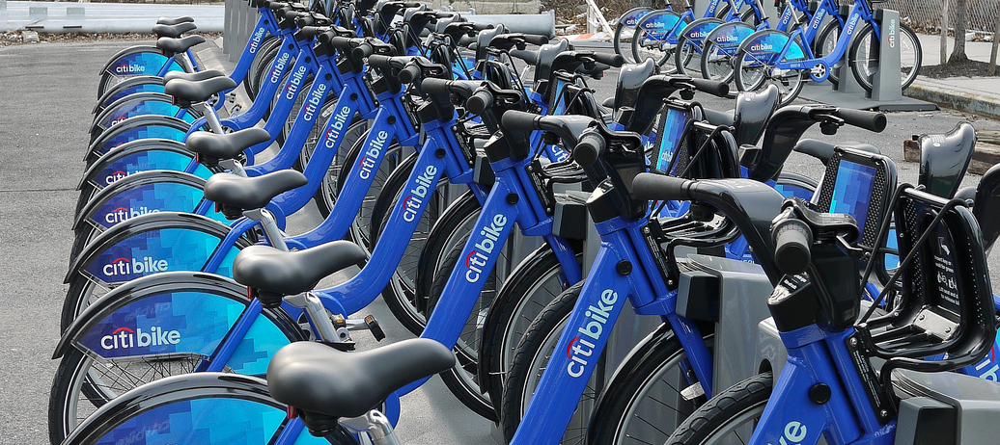

# City-Bike-BigData-Cloud

Citi Bike is New York City’s bike share system, and the largest in the nation. Citi Bike launched in May 2013 and has become an essential part of our transportation network. It's fun, efficient and affordable – not to mention healthy and good for the environment.
Citi Bike, like other bike share systems, consists of a fleet of specially designed, sturdy and durable bikes that are locked into a network of docking stations throughout the city. The bikes can be unlocked from one station and returned to any other station in the system, making them ideal for one-way trips. People use bike share to commute to work or school, run errands, get to appointments or social engagements, and more.
Citi Bike is available for use 24 hours/day, 7 days/week, 365 days/year, and riders have access to thousands of bikes at hundreds of stations across Manhattan, Brooklyn, Queens and Jersey City.

          

The task
----

The objective of this project is process citi-bikes data obtained from [Official CitiBike Data Web Page](https://s3.amazonaws.com/tripdata/index.html) in the cloud to storage a daily basis DataWarehouse

Tools that were used to accomplish this task:

- Python
- SQL
- Spark
- BigQuery
- Google Workflow
- Apache Airflow
- Linux

  

Data
----
The data includes:

- Trip Duration (seconds)
- Start Time and Date
- Stop Time and Date
- Start Station Name
- End Station Name
- Station ID
- Station Lat/Long
- Bike ID
- User Type (Customer = 24-hour pass or 3-day pass user; Subscriber = Annual Member)
- Gender (Zero=unknown; 1=male; 2=female)
- Year of Birth

Note: The information could not be uploaded to the repository since it exceeds the maximum weight that Github establishes

Process
----

The procedure that was taken to process the information is as follows:

- Apply transformation to data using Spark-SQL
- Save the transformed data into Big Query partitioned tables
- Use Google Workflow templates to automate the Spark ETL batch processing job
- Use Apache Airflow to create DAGs and automate the batch processing job

The folder 'Manual Job' have all the scripts step by step in individual batch files that run all process manually.
The folder 'Workflow' automates all the process using an unique batch file that runs all the commands excluding the creation of the tables in Big Query. To run it you should trigger the file manually.
The folder 'Airflow' brings a python file that automates all the proccess, the advange of this script is that is triggers alone everyday at 2:30 pm.

